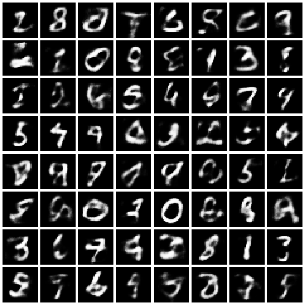
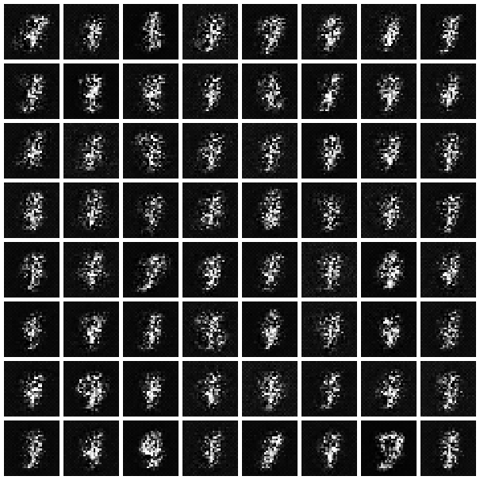
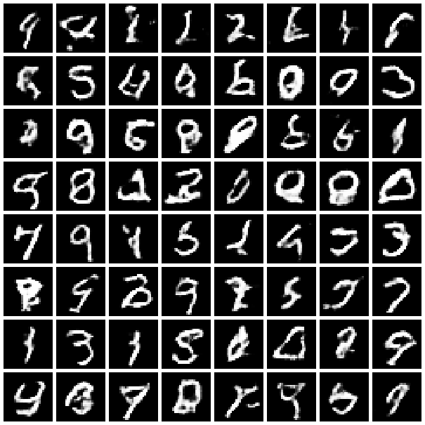
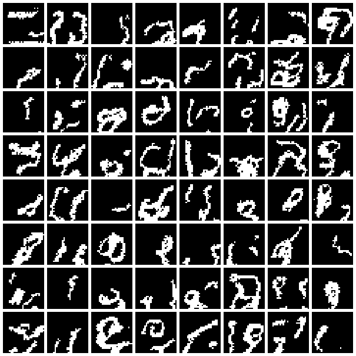
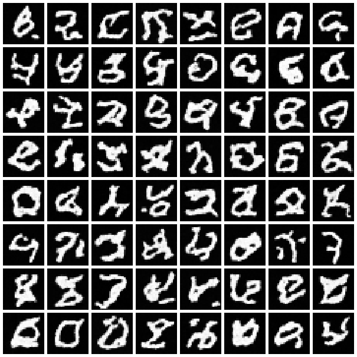

# STAT8201 — Deep Generative Models

> Implementations of the deep-generative-model families studied in **STAT GR8201 — Deep
> Generative Models** (Columbia University, Prof. John P. Cunningham) — VAEs, normalizing
> flows, GANs, autoregressive models, and diffusion models — each trained on MNIST at
> CPU-modest scale and verified by generating **real** samples. Part of a
> [csdiy.wiki](https://csdiy.wiki/) full-catalog build.


## Overview

STAT8201 is a Columbia PhD **seminar**: it meets weekly to present and discuss papers, and
its only graded deliverable is a **major research project** — there is no problem set or
autograder. Rather than invent fake homework, this repo implements, from scratch, one
working model from each of the generative-model families the seminar traces, following the
papers on its reading list (VAE → tighter bounds → GANs → Wasserstein GAN), and extends the
lineage forward to autoregressive and diffusion models. Every model trains end-to-end on
CPU and is verified by measured likelihoods/losses and generated-sample grids in
[`results/`](results/).

The seminar's real schedule (grounded from the official site) covers: VAEs and the ELBO,
adding structure to latent-variable models (dynamics, discrete latents), reparameterization
tricks and control variates, better ELBO bounds (IWAE), disentanglement (β-VAE), GANs, the
Wasserstein GAN, improving GANs, and GANs in NLP/CV.

## Results (measured on CPU, `OMP_NUM_THREADS=3`, Python 3.11 / PyTorch 2.12)

| Assignment | Model | What it does | Result (measured) |
|---|---|---|---|
| a1 | **VAE** (Kingma & Welling 2014) | ELBO + reparameterization on binarized MNIST | test **−ELBO 101.07 nats**; IWAE (k=50) **−96.87 nats** |
| a2 | **RealNVP** (Dinh et al. 2017) | exact-likelihood normalizing flow | test **−4.90 bits/dim**† |
| a3 | **DCGAN** (Goodfellow 2014 / Radford 2016) | adversarial generation, BCE + WGAN-GP | final loss D **1.19** / G **0.92** (stable) |
| a4 | **PixelCNN** (van den Oord 2016) | autoregressive masked-conv likelihood | test NLL **96.36 nats** (**0.177 bpd**) |
| a5 | **DDPM** (Ho et al. 2020) | denoising diffusion, ε-prediction U-Net | final denoising MSE **0.058** |

† The RealNVP bits/dim is negative because near-binary MNIST is modeled as a *continuous*
density after logit-dequantization; the logit change-of-variables Jacobian is large and
positive. This is a known artifact of continuous-density modeling of nearly-binary data,
not an error — the Jacobian is checked against autograd in `tests/`.

### Generated samples

| VAE | RealNVP | DCGAN | PixelCNN | DDPM |
|---|---|---|---|---|
|  |  |  |  |  |

VAE reconstructions (top row = inputs, bottom row = model): [`results/a1_vae/reconstructions.png`](results/a1_vae/reconstructions.png).

## Implemented assignments

- [x] **a1 — Variational Autoencoder** — MLP VAE, closed-form Gaussian KL, reparameterization trick, IWAE log-likelihood evaluation.
- [x] **a2 — Normalizing Flow (RealNVP)** — affine coupling layers, 2D spatial checkerboard masks, logit dequantization, exact bits/dim.
- [x] **a3 — GAN** — DCGAN generator/discriminator with two objectives: original non-saturating **BCE** and **Wasserstein GAN with gradient penalty**.
- [x] **a4 — Autoregressive (PixelCNN)** — masked convolutions (type-A/B), residual stack, exact Bernoulli likelihood, sequential sampling.
- [x] **a5 — Diffusion (DDPM)** — forward noising schedule, U-Net ε-predictor with sinusoidal time embeddings, ancestral reverse sampling.

Theory derivations for each (ELBO, IWAE, change-of-variables, JS/Wasserstein, DDPM
objective) are in [`notes/theory.md`](notes/theory.md).

## Project structure

```
stat8201-dgm/
├── common/               # shared: MNIST loaders, seeding, CPU threads, image-grid saver
├── a1_vae/               # VAE: model.py, train.py
├── a2_normalizing_flows/ # RealNVP
├── a3_gan/               # DCGAN (BCE + WGAN-GP)
├── a4_autoregressive/    # PixelCNN
├── a5_diffusion/         # DDPM
├── tests/                # correctness checks (invertibility, log-dets, AR masking, KL)
├── notes/theory.md       # derivations
├── results/              # measured metrics.json + sample grids (committed evidence)
└── requirements.txt
```

## How to run

```bash
# Python repos use the shared csdiy env (Python 3.11, CPU):
#   D:\Project\_csdiy\.venv-ml\Scripts\python.exe
pip install -r requirements.txt   # torch, torchvision, numpy, matplotlib, pytest

# Correctness tests (stand in for the seminar's absent autograder):
python -m pytest tests/ -q

# Train each model (MNIST auto-downloads on first run). Example full-run commands:
python -m a1_vae.train              --epochs 15                                  --results results/a1_vae
python -m a2_normalizing_flows.train --epochs 10 --train-subset 20000 --n-coupling 8 --results results/a2_flow
python -m a3_gan.train --loss bce    --epochs 12 --train-subset 30000            --results results/a3_gan
python -m a3_gan.train --loss wgan_gp --epochs 12 --train-subset 30000           --results results/a3_gan_wgan
python -m a4_autoregressive.train    --epochs 6  --train-subset 20000            --results results/a4_pixelcnn
python -m a5_diffusion.train         --epochs 15 --train-subset 20000 --timesteps 200 --results results/a5_diffusion
```

Each training script writes `samples.png` and a `metrics.json` (with full per-epoch
history) into its `--results` directory. Use `--train-subset` to trade fidelity for speed;
omit it to use all 60k training images.

## Verification

- **Correctness tests** — `python -m pytest tests/ -q` → **10 passed**. These check the
  properties that make each model correct: RealNVP is *exactly* invertible and its reported
  `log|det J|` matches an autograd Jacobian; the logit-preprocessing Jacobian matches
  `d/dv`; the VAE's Gaussian KL is non-negative and zero at `N(0,I)`; **PixelCNN's masking
  leaks exactly zero gradient to the current and future pixels** (the defining
  autoregressive property); DDPM's `ᾱ_t` schedule is monotone and `q_sample` matches its
  closed form.
- **Real training runs** — the numbers and every image above were produced by the commands
  in "How to run", executed on this CPU-only machine; raw logs and `metrics.json` files are
  under `results/`. The VAE's −ELBO ≈ 101 nats and IWAE ≈ −97 nats match published values
  for a 20-d MLP VAE on binarized MNIST.

## Tech stack

Python 3.11, PyTorch 2.12 (CPU), torchvision (MNIST), NumPy, Matplotlib, pytest.

## Key ideas / what I learned

- **One latent-variable idea, many faces.** VAEs optimize a *lower bound* (ELBO) on
  likelihood; normalizing flows and autoregressive models compute likelihood *exactly*
  (via change-of-variables and the chain rule respectively); GANs abandon likelihood for an
  adversarial objective; diffusion turns generation into iterative denoising.
- **The reparameterization trick** is what makes the VAE trainable end-to-end — it moves the
  sampling randomness out of the path of the gradient.
- **Tighter bounds matter**: the IWAE multi-sample bound is provably tighter than the ELBO
  and gives a better estimate of held-out log-likelihood.
- **Invertibility with a cheap Jacobian** is the whole trick of flows — affine coupling
  layers are invertible by construction and have a triangular Jacobian.
- **Masking = autoregression**: PixelCNN gets a valid pixel ordering purely from masked
  convolution weights, verified here by a zero-gradient-leak test.
- **Wasserstein distance vs. JS divergence**: WGAN-GP replaces the saturating JS objective
  with an Earth-Mover distance and a soft Lipschitz (gradient) penalty, giving a smoother
  training signal.

## Credits & license

Based on the topics and reading list of **STAT GR8201 — Deep Generative Models** by
**Prof. John P. Cunningham, Columbia University**
([course site](http://stat.columbia.edu/~cunningham/teaching/GR8201/)). This repository is
an independent educational reimplementation; all course materials and the original papers
belong to their respective authors. The MNIST dataset is downloaded at runtime and is not
redistributed here. Original code in this repo is released under the [MIT License](LICENSE).
